# Graphs For Two 2048MB MDS / 16 Clients

## First Run

Complete in 263m35.568s.

#### Memory (RSS)
##### MDS 0
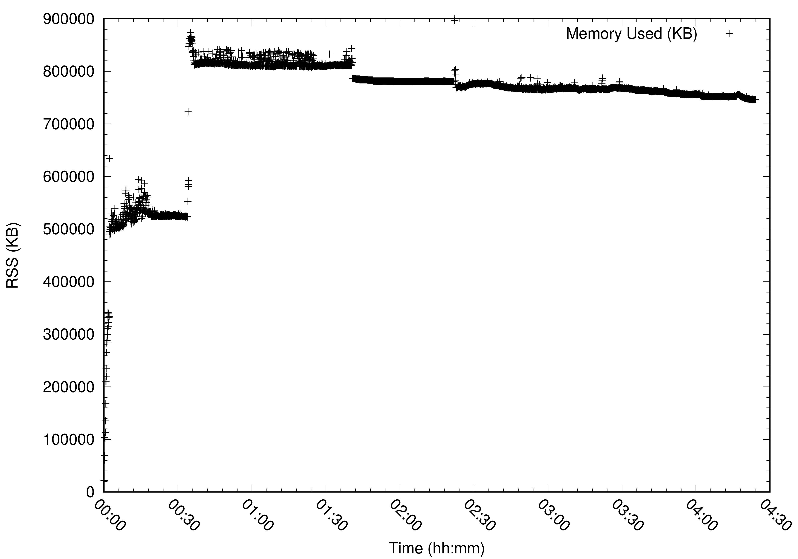
##### MDS 1
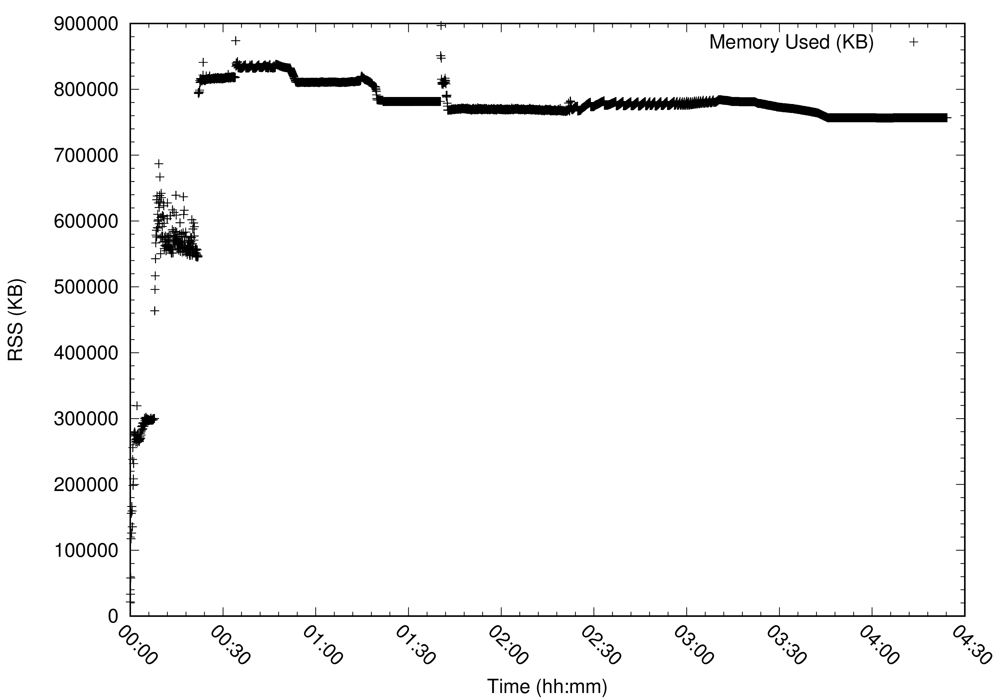

#### Number of caps issued
##### MDS 0
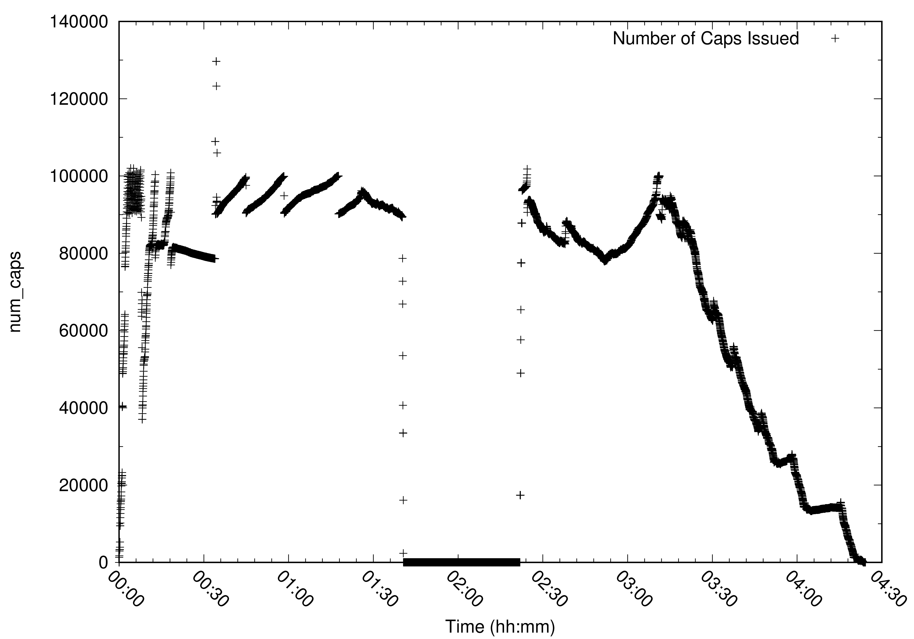
##### MDS 1
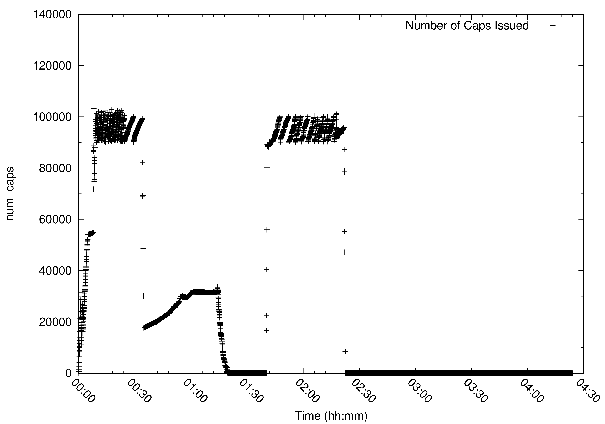

#### Imported inodes
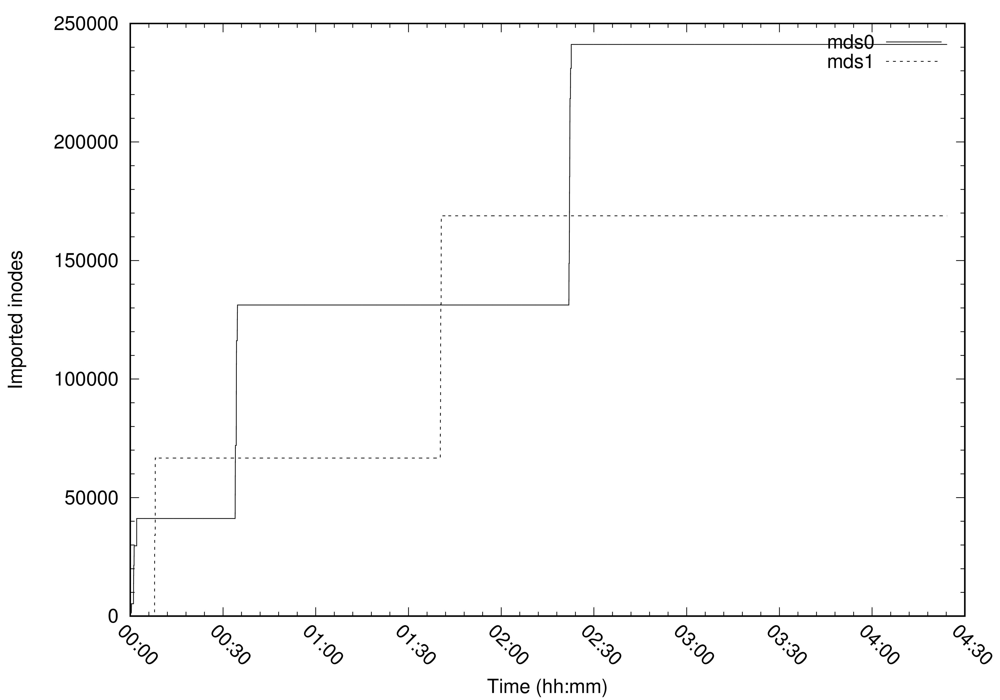

## Second Run

(Never finished. 4/16 clients stalled: http://tracker.ceph.com/issues/18641)

#### Memory (RSS)
##### MDS 0
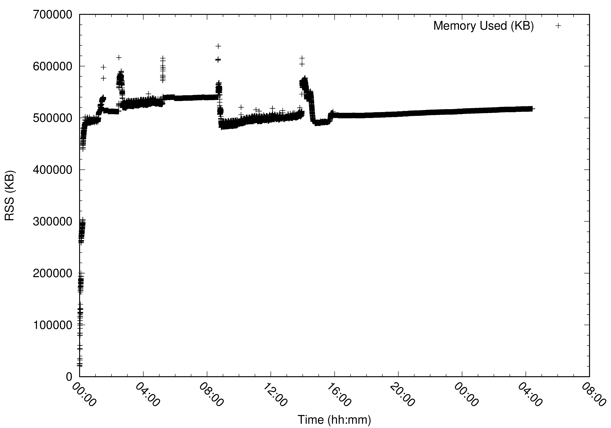
##### MDS 1
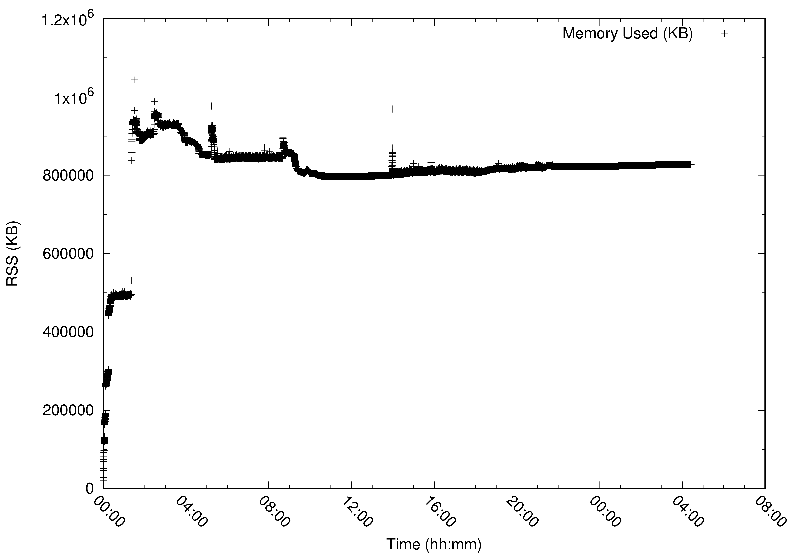

#### Number of caps issued
##### MDS 0
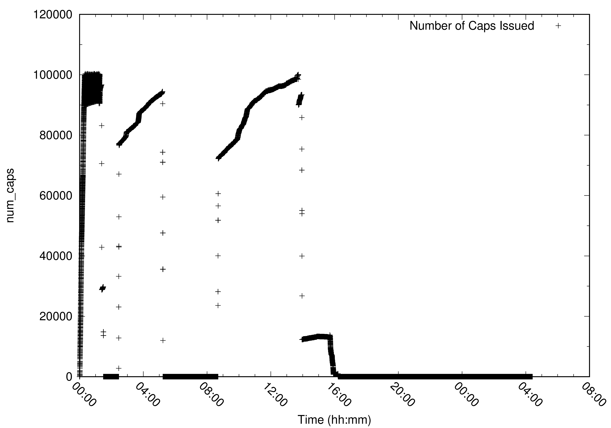
##### MDS 1
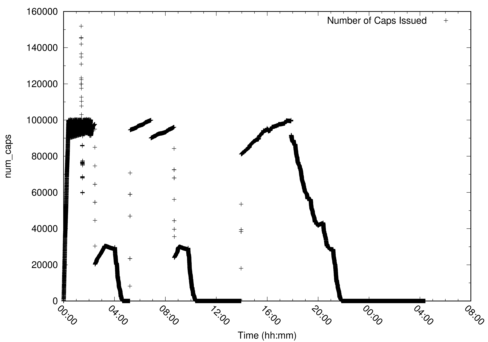

#### Imported inodes
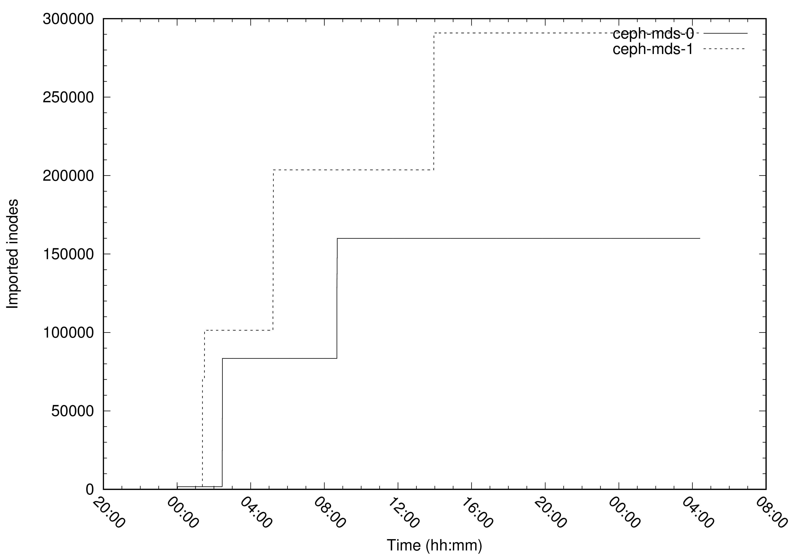

#### Auth Subtrees
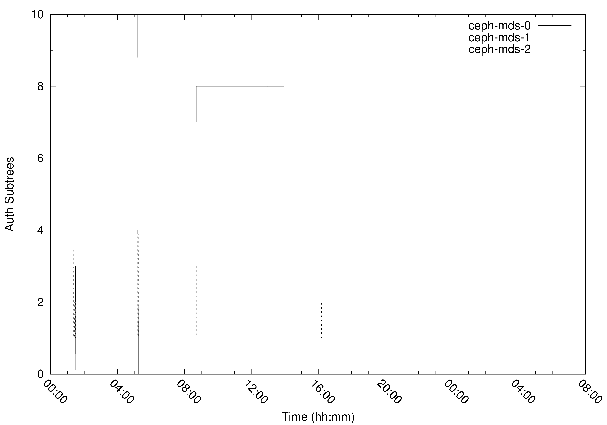
