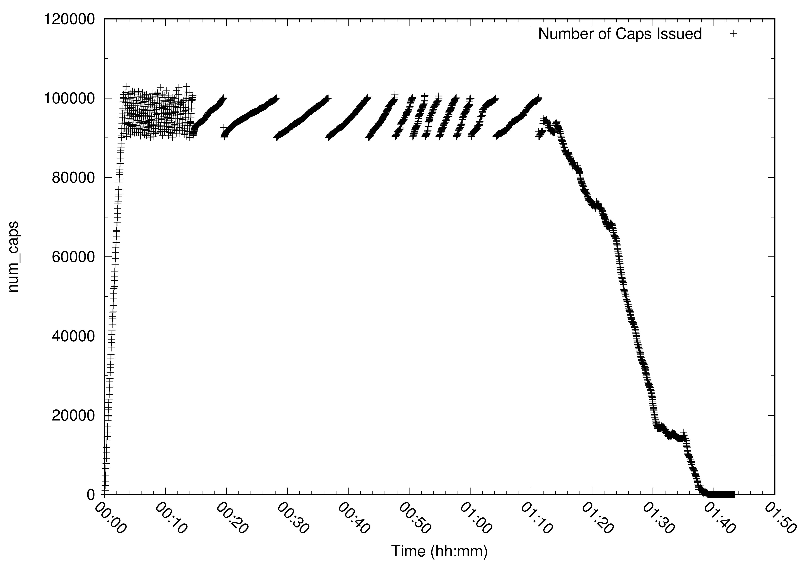
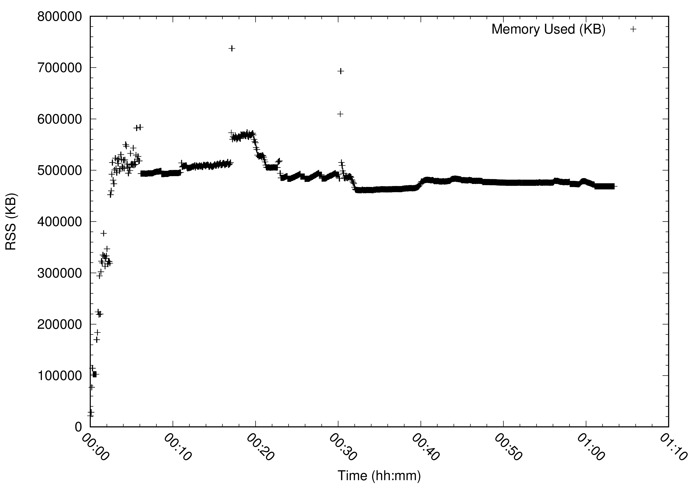
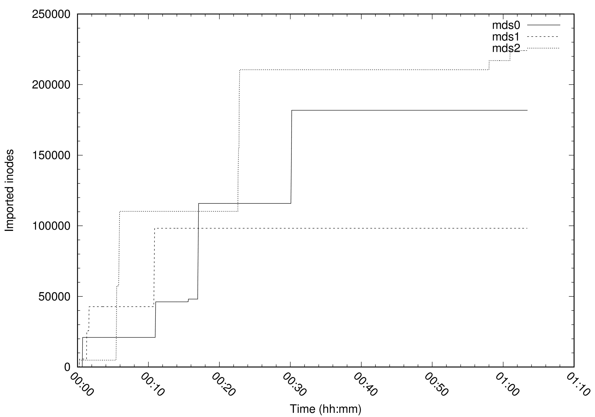
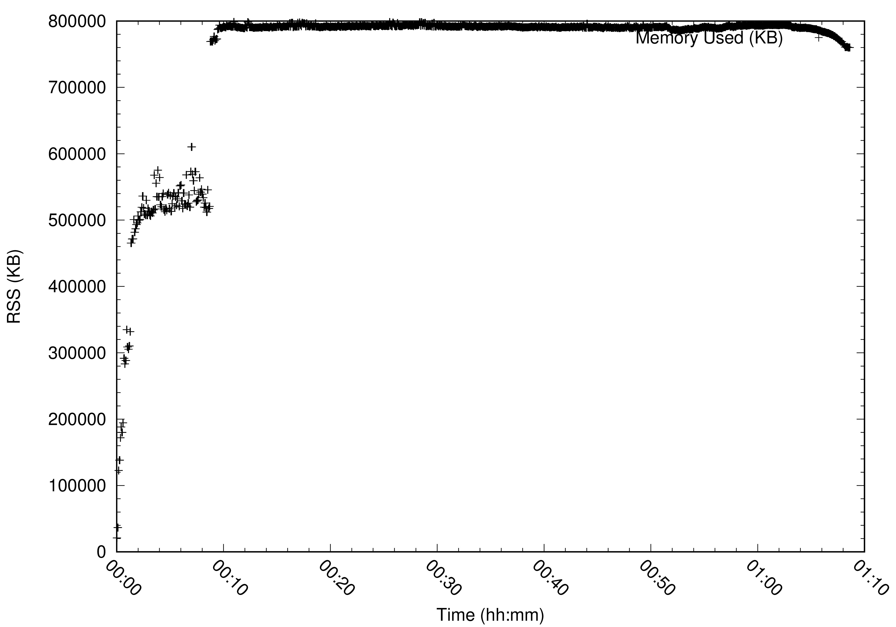
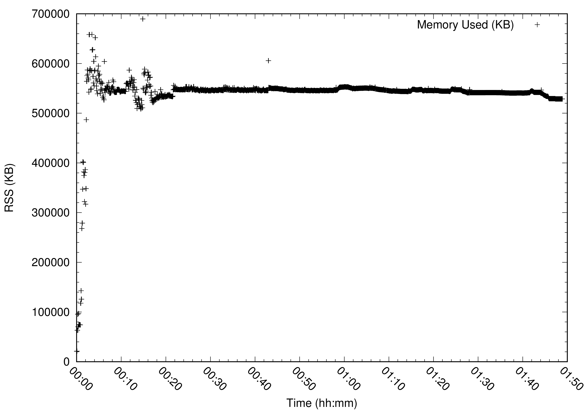
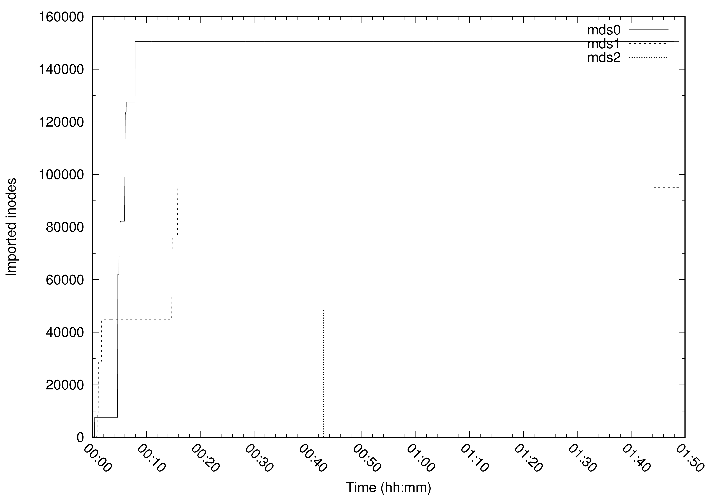

# Graphs For All Configurations:

* [Configuration 2048MB MDS / 8 Clients](#configuration-2048mb-mds--8-clients)
* [Configuration 2048MB MDS / 16 Clients](#configuration-2048mb-mds--16-clients)
* [Configuration 4096MB MDS / 8 Clients](#configuration-4096mb-mds--8-clients)
* [Configuration 4096MB MDS / 16 Clients](#configuration-4096mb-mds--16-clients)

## Configuration 2048MB MDS / 8 Clients

### 1 Active MDS

Complete in 99m4.928s.

#### Memory (RSS)

#### Number of caps issued

### 3 Active MDS

Complete in 63m21.782s.

#### Memory (RSS)
##### MDS 0

##### MDS 1

##### MDS 2

#### Number of caps issued
##### MDS 0

##### MDS 1

##### MDS 2

#### Imported inodes

## Configuration 2048MB MDS / 16 Clients

### 1 Active MDS

Complete in 323m23.187s.

#### Memory (RSS)

#### Number of caps issued

### 3 Active MDS

Complete in 84m.

#### Memory (RSS)
##### MDS 0

##### MDS 1

##### MDS 2

#### Number of caps issued
##### MDS 0

##### MDS 1

##### MDS 2

#### Imported inodes

## Configuration 4096MB MDS / 8 Clients

### 1 Active MDS

Complete in 68m22.712s.

#### Memory (RSS)

#### Number of caps issued

### 3 Active MDS

Complete in 50m2.820s.

#### Memory (RSS)
##### MDS 0

##### MDS 1

##### MDS 2

#### Number of caps issued
##### MDS 0

##### MDS 1

##### MDS 2

#### Imported inodes

## Configuration 4096MB MDS / 16 Clients

### 1 Active MDS

Complete in 147m49.498s.

#### Memory (RSS)

#### Number of caps issued

### 3 Active MDS

Complete in 108m28.457s.

#### Memory (RSS)
##### MDS 0

##### MDS 1

##### MDS 2

#### Number of caps issued
##### MDS 0

##### MDS 1

##### MDS 2

#### Imported inodes

